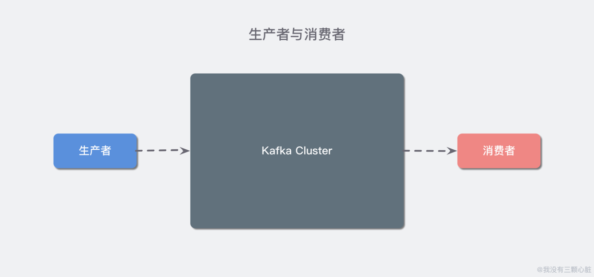
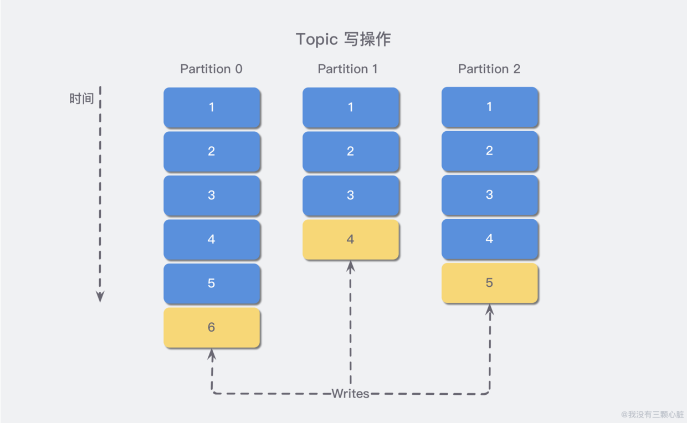

> 本文由 JavaGuide 读者推荐，JavaGuide 对文章进行了整理排版！原文地址：https://www.wmyskxz.com/2019/07/17/kafka-ru-men-jiu-zhe-yi-pian/ ， 作者：我没有三颗心脏。

# 一、Kafka 简介

------

## Kafka 创建背景

**Kafka** 是一个消息系统，原本开发自 LinkedIn，用作 LinkedIn 的活动流（Activity Stream）和运营数据处理管道（Pipeline）的基础。现在它已被[多家不同类型的公司](https://cwiki.apache.org/confluence/display/KAFKA/Powered+By) 作为多种类型的数据管道和消息系统使用。

**活动流数据**是几乎所有站点在对其网站使用情况做报表时都要用到的数据中最常规的部分。活动数据包括页面访问量（Page View）、被查看内容方面的信息以及搜索情况等内容。这种数据通常的处理方式是先把各种活动以日志的形式写入某种文件，然后周期性地对这些文件进行统计分析。**运营数据**指的是服务器的性能数据（CPU、IO 使用率、请求时间、服务日志等等数据)。运营数据的统计方法种类繁多。

近年来，活动和运营数据处理已经成为了网站软件产品特性中一个至关重要的组成部分，这就需要一套稍微更加复杂的基础设施对其提供支持。

## Kafka 简介

Kafka 是一种分布式的，基于发布 / 订阅的消息系统。主要设计目标如下：

- 以时间复杂度为 O(1) 的方式提供消息持久化能力，即使对 TB 级以上数据也能保证常数时间复杂度的访问性能。
- 高吞吐率。即使在非常廉价的商用机器上也能做到单机支持每秒 100K 条以上消息的传输。
- 支持 Kafka Server 间的消息分区，及分布式消费，同时保证每个 Partition 内的消息顺序传输。
- 同时支持离线数据处理和实时数据处理。
- Scale out：支持在线水平扩展。

## Kafka 基础概念

### 概念一：生产者与消费者

对于 Kafka 来说客户端有两种基本类型：**生产者（Producer）**和**消费者（Consumer）**。除此之外，还有用来做数据集成的 Kafka Connect API 和流式处理的 Kafka Streams 等高阶客户端，但这些高阶客户端底层仍然是生产者和消费者API，它们只不过是在上层做了封装。

这很容易理解，生产者（也称为发布者）创建消息，而消费者（也称为订阅者）负责消费or读取消息。

### 概念二：主题（Topic）与分区（Partition）

在 Kafka 中，消息以**主题（Topic）**来分类，每一个主题都对应一个「消息队列」，这有点儿类似于数据库中的表。但是如果我们把所有同类的消息都塞入到一个“中心”队列中，势必缺少可伸缩性，无论是生产者/消费者数目的增加，还是消息数量的增加，都可能耗尽系统的性能或存储。

我们使用一个生活中的例子来说明：现在 A 城市生产的某商品需要运输到 B 城市，走的是公路，那么单通道的高速公路不论是在「A 城市商品增多」还是「现在 C 城市也要往 B 城市运输东西」这样的情况下都会出现「吞吐量不足」的问题。所以我们现在引入**分区（Partition）**的概念，类似“允许多修几条道”的方式对我们的主题完成了水平扩展。

### 概念三：Broker 和集群（Cluster）

一个 Kafka 服务器也称为 Broker，它接受生产者发送的消息并存入磁盘；Broker 同时服务消费者拉取分区消息的请求，返回目前已经提交的消息。使用特定的机器硬件，一个 Broker 每秒可以处理成千上万的分区和百万量级的消息。（现在动不动就百万量级..我特地去查了一把，好像确实集群的情况下吞吐量挺高的..摁..）

若干个 Broker 组成一个集群（Cluster），其中集群内某个 Broker 会成为集群控制器（Cluster Controller），它负责管理集群，包括分配分区到 Broker、监控 Broker 故障等。在集群内，一个分区由一个 Broker 负责，这个 Broker 也称为这个分区的 Leader；当然一个分区可以被复制到多个 Broker 上来实现冗余，这样当存在 Broker 故障时可以将其分区重新分配到其他 Broker 来负责。下图是一个样例：

Kafka 的一个关键性质是日志保留（retention），我们可以配置主题的消息保留策略，譬如只保留一段时间的日志或者只保留特定大小的日志。当超过这些限制时，老的消息会被删除。我们也可以针对某个主题单独设置消息过期策略，这样对于不同应用可以实现个性化。

### 概念四：多集群

随着业务发展，我们往往需要多集群，通常处于下面几个原因：

- 基于数据的隔离；
- 基于安全的隔离；
- 多数据中心（容灾）

当构建多个数据中心时，往往需要实现消息互通。举个例子，假如用户修改了个人资料，那么后续的请求无论被哪个数据中心处理，这个更新需要反映出来。又或者，多个数据中心的数据需要汇总到一个总控中心来做数据分析。

上面说的分区复制冗余机制只适用于同一个 Kafka 集群内部，对于多个 Kafka 集群消息同步可以使用 Kafka 提供的 MirrorMaker 工具。本质上来说，MirrorMaker 只是一个 Kafka 消费者和生产者，并使用一个队列连接起来而已。它从一个集群中消费消息，然后往另一个集群生产消息。

# 二、Kafka 的设计与实现

------

上面我们知道了 Kafka 中的一些基本概念，但作为一个成熟的「消息队列」中间件，其中有许多有意思的设计值得我们思考，下面我们简单列举一些。

## 讨论一：Kafka 存储在文件系统上

是的，**您首先应该知道 Kafka 的消息是存在于文件系统之上的**。Kafka 高度依赖文件系统来存储和缓存消息，一般的人认为 “磁盘是缓慢的”，所以对这样的设计持有怀疑态度。实际上，磁盘比人们预想的快很多也慢很多，这取决于它们如何被使用；一个好的磁盘结构设计可以使之跟网络速度一样快。

现代的操作系统针对磁盘的读写已经做了一些优化方案来加快磁盘的访问速度。比如，**预读**会提前将一个比较大的磁盘快读入内存。**后写**会将很多小的逻辑写操作合并起来组合成一个大的物理写操作。并且，操作系统还会将主内存剩余的所有空闲内存空间都用作**磁盘缓存**，所有的磁盘读写操作都会经过统一的磁盘缓存（除了直接 I/O 会绕过磁盘缓存）。综合这几点优化特点，**如果是针对磁盘的顺序访问，某些情况下它可能比随机的内存访问都要快，甚至可以和网络的速度相差无几。**

**上述的 Topic 其实是逻辑上的概念，面相消费者和生产者，物理上存储的其实是 Partition**，每一个 Partition 最终对应一个目录，里面存储所有的消息和索引文件。默认情况下，每一个 Topic 在创建时如果不指定 Partition 数量时只会创建 1 个 Partition。比如，我创建了一个 Topic 名字为 test ，没有指定 Partition 的数量，那么会默认创建一个 test-0 的文件夹，这里的命名规则是：`<topic_name>-<partition_id>`。

